# 💰 Safe Salary - Web3 Treasury & Payroll Management

**Safe Salary** is a comprehensive Flutter application for managing company treasury, employee payroll, and team operations in the Web3 ecosystem. Built with secure authentication and multi-chain wallet support, it provides businesses with the tools they need to manage salaries and treasury assets across blockchain networks.

## ✨ Features

### 🏦 Treasury Management
- **Real-time Treasury Dashboard** - Monitor total treasury value with live updates
- **Asset Allocation Visualization** - Interactive pie charts showing distribution across chains
- **Multi-Chain Support** - Manage assets on Sonic, Ethereum, and Arbitrum networks
- **Growth Tracking** - Monthly performance metrics and trend analysis

### 👥 Team & Payroll Management
- **Employee Database** - Comprehensive team member profiles with roles and nationalities
- **Payroll Processing** - Streamlined salary payments in USDC
- **Payment History** - Track all employee payments with status monitoring
- **Ethereum Integration** - Each team member has associated Ethereum addresses for payments

### 💼 Company Operations
- **Team Overview** - Analytics on team size, payroll, and geographic distribution
- **Employee Management** - Add, edit, and manage team member information
- **Address Management** - Copy and manage Ethereum addresses for all team members
- **Salary Analytics** - Calculate average salaries and total payroll costs

### 🔐 Secure Authentication & Wallets
- **PrivySDK Integration** - Secure email-based authentication
- **Multi-Chain Wallets** - Create and manage Ethereum and Solana wallets
- **Embedded Wallet Support** - Seamless wallet creation and management
- **Cross-Platform Security** - Works on iOS and Android with enterprise-grade security

## 🚀 Getting Started

### Prerequisites
- Flutter 3.0+ installed
- iOS/Android development environment set up
- Privy account and app credentials

### 1. Clone the Repository
```bash
git clone https://github.com/your-org/safe-salary.git
cd safe-salary
```

### 2. Environment Setup
Create a `.env` file in the root directory with your Privy credentials:

```env
PRIVY_APP_ID=your_privy_app_id_here
PRIVY_CLIENT_ID=your_privy_client_id_here
```

> **Note:** Get your credentials from the [Privy Dashboard](https://dashboard.privy.io)

### 3. Install Dependencies
```bash
flutter pub get
```

### 4. Run the Application
```bash
flutter run
```

## 📱 Application Structure

### Navigation
The app uses a bottom navigation structure with four main sections:

- **🏠 Home** - Welcome and quick actions
- **💰 Treasury** - Main dashboard and asset management (Default landing page)
- **👥 Company** - Team management and employee operations  
- **💼 Wallets** - Wallet creation and management

### Key Screens

#### Treasury Dashboard
- Total treasury value display
- Asset allocation charts (Sonic USDC, Ethereum AAVE USDC, Arbitrum AAVE USDT)
- Recent employee payments table
- Quick action buttons for payroll and rebalancing

#### Company Management
- Team member grid with photos and salary information
- Add new team members
- View and copy Ethereum addresses
- Team analytics and metrics

#### Wallet Management
- Create new Ethereum and Solana wallets
- View existing wallet addresses
- Wallet management tools

## 🛠 Technical Architecture

### Built With
- **Flutter** - Cross-platform mobile framework
- **PrivySDK** - Authentication and wallet management
- **fl_chart** - Interactive charts and data visualization
- **GoRouter** - Navigation and routing
- **Material Design 3** - Modern UI components

### Key Dependencies
```yaml
dependencies:
  flutter: ^3.0.0
  privy_flutter: ^latest
  fl_chart: ^latest
  go_router: ^latest
  # ... other dependencies
```

## 🔧 Configuration

### Privy Setup
1. Create an account at [Privy.io](https://privy.io)
2. Create a new app in the dashboard
3. Enable email authentication
4. Copy your App ID and Client ID to the `.env` file

### Customization
The app supports extensive customization:
- **Theme Colors** - Modify `lib/core/app_colors.dart`
- **Employee Data** - Update sample data in company management
- **Treasury Assets** - Configure supported chains and tokens
- **Payment Methods** - Customize supported payment tokens

## 📊 Features in Detail

### Treasury Analytics
- **Real-time Balances** - Live treasury value tracking
- **Asset Distribution** - Visual breakdown of holdings across chains
- **Growth Metrics** - Monthly and historical performance data
- **Payment Summaries** - Total paid amounts and trends

### Employee Management
- **Comprehensive Profiles** - Names, roles, nationalities, salaries
- **Ethereum Integration** - Associated wallet addresses for payments
- **Payment Status** - Track completed and pending salary payments
- **Team Analytics** - Insights on team composition and costs

### Security Features
- **Privy Authentication** - Enterprise-grade security
- **Embedded Wallets** - Secure, non-custodial wallet management
- **Address Verification** - Validation of Ethereum addresses
- **Secure Storage** - Encrypted local data storage

## 🤝 Contributing

We welcome contributions! Please see our contributing guidelines:

1. Fork the repository
2. Create a feature branch (`git checkout -b feature/amazing-feature`)
3. Commit your changes (`git commit -m 'Add amazing feature'`)
4. Push to the branch (`git push origin feature/amazing-feature`)
5. Open a Pull Request

## 📄 License

This project is licensed under the MIT License - see the [LICENSE](LICENSE) file for details.

## 🆘 Support

- **Documentation** - [Privy Docs](https://docs.privy.io)
- **Issues** - Report bugs via GitHub Issues
- **Discussions** - Join our community discussions

## 🗺 Roadmap

- [ ] Multi-signature wallet support
- [ ] Advanced treasury rebalancing
- [ ] Integration with DeFi protocols
- [ ] Enhanced analytics and reporting
- [ ] Mobile-responsive web version
- [ ] Additional blockchain network support

---

**Safe Salary** - Revolutionizing payroll and treasury management for the Web3 era 🚀

```mermaid
sequenceDiagram
    participant E as 👔 Employer
    participant SA as 📱 Safe Salary App
    participant EMP as 👤 Employee
    participant ZK as 🔐 Self.xyz (ZK Verification)
    participant BC as ⛓️ Blockchain Contract
    participant CCTP as 🌐 Circle CCTP

    Note over E, CCTP: Safe, Verified, Multi-Chain Payroll

    E->>SA: 1️⃣ Create Privy Account
    Note right of SA: Secure wallet creation<br/>Enterprise authentication

    E->>SA: 2️⃣ Add Employee Details
    Note right of SA: Name, role, salary<br/>No sensitive documents needed

    SA->>EMP: 3️⃣ Invite Employee Verification
    EMP->>ZK: Submit ZK Proof
    Note right of ZK: Proves identity without<br/>sharing documents<br/>(DOB, Name, Nationality)

    EMP->>SA: Provide Wallet Address & Chain
    Note right of SA: Employee controls<br/>their own wallet

    ZK->>BC: 4️⃣ Register Verified Identity
    Note right of BC: Tamper-proof verification<br/>recorded on-chain

    Note over E, CCTP: ✅ Team is now verified & ready for payroll

    E->>SA: 6️⃣ Click "Process Payroll"
    SA->>CCTP: 5️⃣ Execute Cross-Chain Payments
    Note right of CCTP: Pay to any supported chain<br/>(Ethereum, Arbitrum, Sonic)

    CCTP->>EMP: 💰 Receive USDC Salary
    Note right of EMP: Direct to employee's<br/>chosen wallet & chain

    Note over E, EMP: 🎉 Secure, Private, Instant Payroll Complete
```


